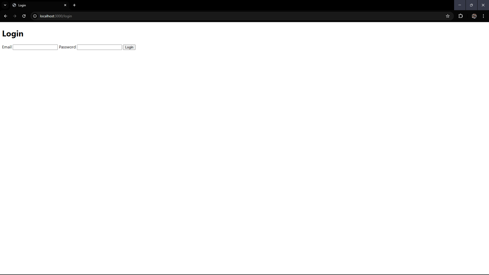

## URL Shortener Project

Welcome to the **URL Shortener** project! This application allows users to shorten long URLs into shareable links. It also provides features like **URL analytics** and **user authentication** to enhance user experience.

---

## Table of Contents
- [Features](#features)
- [Setup Instructions](#setup-instructions)
- [Project Structure](#project-structure)
- [Frontend Screenshots](#frontend-screenshots)
- [Technologies Used](#technologies-used)
- [Contributing](#contributing)
- [License](#license)

---

## Features
✅ **URL Shortening**: Convert long URLs into short, easy-to-share links.  
✅ **User Authentication**: Sign up and log in to manage your shortened URLs.  
✅ **URL Analytics**: Track clicks and view analytics for each shortened URL.  
✅ **Role-Based Access Control**: Differentiate between normal users and admins.  
✅ **Responsive UI**: A clean and user-friendly interface built with **EJS templates**.  

---

## Setup Instructions

### Prerequisites
Ensure you have the following installed on your machine:
- **Node.js** and **npm**
- **MongoDB** (running locally or via a cloud service like MongoDB Atlas)

### Installation
1. **Clone the Repository**
   ```bash
   git clone https://github.com/patil-piyush/Short-URL.git
   cd Short-URL
   ```
2. **Install Dependencies**
   ```bash
   npm install
   ```
3. **Set Up Environment Variables**
   Create a `.env` file in the root directory and add the following:
   ```env
   MONGODB_URI=mongodb://localhost:27017/short-url
   JWT_SECRET='Patil!0031!'
   ```
4. **Start the Server**
   ```bash
   npm start
   ```
5. **Access the Application**
   Open your browser and go to: [http://localhost:3000](http://localhost:3000)

---

## Project Structure
```bash
url-shortener/
├── controllers/
│   ├── url.js
│   └── user.js
├── middlewares/
│   └── auth.js
├── models/
│   ├── url.js
│   └── user.js
├── routes/
│   ├── staticRouter.js
│   ├── url.js
│   └── user.js
├── service/
│   └── auth.js
├── views/
│   ├── home.ejs
│   ├── login.ejs
│   └── signup.ejs
├── connect.js
├── index.js
├── package.json
└── README.md
```

---

## Frontend Screenshots
### 🏠 Home Page
- Users can generate new short URLs and view existing shortened URLs.


### 🔑 Login Page
- Users log in to access and manage their shortened URLs.


### 📝 Signup Page
- New users can create an account to start using the service.


### 📊 URL Analytics Page
- View detailed analytics for each shortened URL, including click counts and timestamps.


---

## Technologies Used
- **Backend**: Node.js, Express.js
- **Database**: MongoDB
- **Authentication**: JWT (JSON Web Tokens)
- **Frontend**: EJS (Embedded JavaScript templates)
- **URL Shortening**: `shortid` library
- **Other Libraries**: mongoose, cookie-parser, uuid

---

## Contributing
Contributions are welcome! Follow these steps:

1. **Fork the repository**
2. **Create a new branch**
   ```bash
   git checkout -b feature/YourFeatureName
   ```
3. **Commit your changes**
   ```bash
   git commit -m 'Add some feature'
   ```
4. **Push to the branch**
   ```bash
   git push origin feature/YourFeatureName
   ```
5. **Open a pull request**

---

## License
This project is licensed under the **MIT License**. See the `LICENSE` file for details.

---

### Thank you for checking out the URL Shortener project! 🚀 If you have any questions or need help, feel free to open an issue or contact the maintainers.
